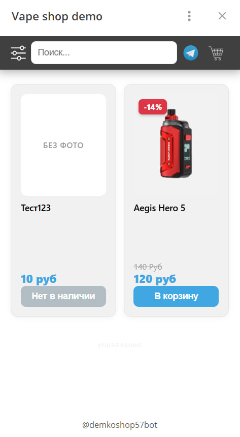

## Описание
Интернет магазин для Telegram Mini Apps (мой первый пет проект)

Посмотреть можно тут:
* **https://t.me/demkoshop57bot/shop57demko**

## Окружение и сборка
Проект можно разрабатывать в VS Code и запустить на локальном сервере через например XAMPP

### Проверенная конфигурация
* **PHP 8+**
* **MySQL**
* **Apache**


## Краткий гайд по использованию

1. Переименовать config.example.php в config.php

2. Заполнить config.php своими данными

3. Залить на хост / использовать localhost

4. Создать базу данных 

## Структура БД

```sql
CREATE TABLE products (
    id          INT AUTO_INCREMENT PRIMARY KEY,
    title       VARCHAR(60) NOT NULL,
    category_id INT,
    price       INT NOT NULL,
    old_price   INT,
    description TEXT,
    images      JSON,
    out_of_stock TINYINT(1) DEFAULT 0,
    created_at  TIMESTAMP DEFAULT CURRENT_TIMESTAMP
);

CREATE TABLE categories (
    id   INT AUTO_INCREMENT PRIMARY KEY,
    name VARCHAR(25) NOT NULL UNIQUE
);

CREATE TABLE settings (
    `key`   VARCHAR(100) PRIMARY KEY,
    `value` TEXT
);
```

## Известные проблемы и баги
Если сильно захотеть можно сломать макет очень длинными строками.

На некоторых IOS заказ не отправится менеджеру, если запустить мини приложение с главного экрана телеграм (скорее всего баг самого телеграм).